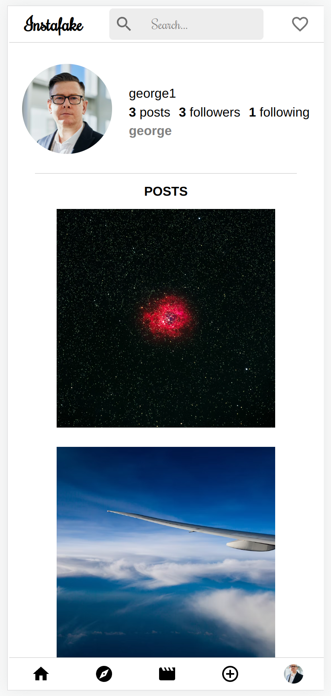

# Introduction 
This is an Instagram MERN stack developed clone where a visitor can come socialize with other users by post, commenting and liking. Just like the real thing, but with a few twists!

# Technologies Used 
* JavaScript
* CSS
* SCSS
* React 
* Mongoose
* Node
* Express

# Getting Started
Follow the link to the live page [here]()

You will be taken to the landing page where you can signup. Once signed up, the main home page will have latest post indexed, but as a new user, you will need to first add followers to your list.

To do this, search for users by their Instafake handle and select one form the dropdown. You will be redirected to their profile page where you can view posts and add comments or likes.

## Navigation
### Edit Profile, Profile Page & Logout
On the bottom right corner, select the default profile icon. A popup will show `Edit Profile`, `Profile Page`, and `Log Out`. A small close button `x` will close the popup.


### New Post
On the bottom navigation bar, the `+` icon will open a form modal. Enter the info and hit `submit`. You will then be redirected to the post 

### Edit Post
In the psot view page, there is a small &#9998; icon in the rop right corner. Once clicked, an edit post modal will pop up where you can perform the necessary edits to the post

### Edit Comment
Similar to edit post, you can edit a comment in place by clicking the smaill &#9998; icon in the top right corner. An input field will appear for you to add your updated comment


# Planning
[Trello Board](https://trello.com/b/vuaFWrQn/instagram-group-project)

[ERD Link](https://lucid.app/lucidchart/20ac1712-5f97-4b01-88d0-bbc0a042941d/edit?viewport_loc=-1744%2C-2628%2C3792%2C3196%2C0_0&invitationId=inv_86eb7153-ab70-4ab3-a19b-dbbd7e905dff)

<!-- ## Wire frames

### Landing Page


### Customer Facing Webpage


### Restaurant Facing Index
 -->

## ERD


# Screenshots
## Landing Page
*Desktop*


*Mobile*


## Home Page

*Desktop*


*Mobile*


## Profile
*Desktop*


*Mobile*




## Search
*Desktop*


*Mobile*


## View Post
*Desktop*


*Mobile*


# Breakdown of Application
Using MERN stack setup, the application has full CRUD capability. The front end is organized into `components` and `pages` to allow for better functional component development.

## Why don't I just go to Instagram instead?
This application will not destroy your attention with countless sponsered content. You will have clean fun socializing with your followers and other users.

Comments are unique to this app. You can delete just like Instagram but what instagram doesnt have is the ability to edit your comment in place! Comments also have timestamps, a bit different 'how long ago' a comment or post was created. You get the date and time posted at the bottom which, we believe, is a better representation of when the comment was created.

The navgation bar UI on Instagram has too much going on, so we decided to stick with a fixed top and bottom navigation. It scales well in both a smaller and bigger screen.

## Models
Modles for `comments`, `followers`, `users` and `posts` were created. A JSON web token is created for each user to the site that is not admin. The password is hashed and salted with 6 rounds for extra security!

### User
```js
const mongoose = require('mongoose')
const bcrypt = require('bcrypt')
const Schema = mongoose.Schema

const SALT_ROUNDS = 6

const userSchema = new Schema({
  name: { type: String, required: true },
  email: {
    type: String,
    unique: true,
    trim: true,
    lowercase: true,
    required: true
  },
  password: {
    type: String,
    trim: true,
    minlength: 3,
    required: true
  },
  handle: { type: String, required: true, unique: true },
  profilePic: { type: String },
  followers: [{ type: Schema.Types.ObjectId, ref: 'Follower' }],
  following: [{ type: Schema.Types.ObjectId, ref: 'User' }],
}, {
  timestamps: true,
  toJSON: {
    transform: function (doc, ret) {
      delete ret.password
      return ret
    }
  }
})
// A user model is created for each visitor to the site that is not admin.
userSchema.pre('save', async function (next) {
  // 'this' is the use document
  if (!this.isModified('password')) return next()
  // update the password with the computed hash
  this.password = await bcrypt.hash(this.password, SALT_ROUNDS)
  return next()
})

module.exports = mongoose.model('User', userSchema, 'users')
```
The node modules has a build in password encryption algorithm called `bcrypt` as an alternative to `SHA-256`. 

Each user has a unique handle, profile picture and and an array of followers and following nested by referenece.

### Comments
```js
const { Schema, model } = require('mongoose')

const commentSchema = new Schema({
  comment: { type: String },
  handle: { type: String },
  posterImage: { type: String },
  poster: { type: Schema.Types.ObjectId, ref: 'User' },
  post: { type: Schema.Types.ObjectId, ref: 'Post' }
}, {
  timestamps: true
})

const Comment = model('Comment', commentSchema)

module.exports = Comment
```
### Posts
Post model uses the `poster` as reference for data collection and retrieval. Also nested in the posts is the comments and likes which will be talked about next. 

```js
const { Schema, model } = require('mongoose')

const postSchema = new Schema({
  // INITIAL POST CREATION
  poster: { type: Schema.Types.ObjectId, ref: 'User' },
  posterName: { type: String },
  posterPic: { type: String },
  image: { type: String },
  location: { type: String },
  caption: { type: String },
  music: { type: String },
  // AFTER POST CREATION
  comments: [{ type: Schema.Types.ObjectId, ref: 'Comment' }],
  likes: [{ type: Schema.Types.ObjectId, ref: 'Like' }]
}, {
  timestamps: true
})

const Post = model('Post', postSchema)

module.exports = Post
```


### Likes & Followers

Likes a followers work in the same way. They are objects that have both the `follower` and `following` nested in the user model as seen previously.

```js
const { Schema, model } = require('mongoose')

const followerSchema = new Schema({
  followerUser: { type: Schema.Types.ObjectId, ref: 'User' },
  userFollowed: { type: Schema.Types.ObjectId, ref: 'User' }
}, {
  timestamps: true
})

const Follower = model('Follower', followerSchema)

module.exports = Follower
```
```js
const { Schema, model } = require('mongoose')

const likeSchema = new Schema({
  liker: { type: Schema.Types.ObjectId, ref: 'User' },
  post: { type: Schema.Types.ObjectId, ref: 'Post' }
}, {
  timestamps: true
})

const Like = model('Like', likeSchema)

module.exports = Like
```
When a user adds a follower or a like, it will nest into the `post` array with the same name reference


## Controllers
CRUD is demonstrated using the main Mongoose methods, `.find()``.findbyIdAndDelete()``.findByIdAndUpdate()` and `.findById()`. To note, as mentioned previously, `followers` and `likes` are simply reference objects used to check the users relation to that data model when displaying it in the front end. For example, if a post has a like from a particular user, it will stay as a like until the user unlikes the post. This is stored in the database and checked in the front end.

The same is true of followers. 

```js
  async destroy (req, res, next) {
    try {
      // find the like passed in
      const like = await Like.findById(req.params.id)
      // getting the like object stored in the post
      await Post.findByIdAndUpdate(like.post, {
        $pull: {
          // pulling the object stored in the array matching the comment id
          likes: { $in: [req.params.id] }
        }
      })
      // deleting the like
      await Like.deleteOne(like)
      res.locals.data.like = like
      next()
    } catch (e) {
      res.status(400).json(e)
    }
  },
  
  async create (req, res, next) {
    try {
      const like = await Like.create(req.body)
      // pass in the id of the post so it can be found
      await Post.findByIdAndUpdate(like.post, {
        $push: {
          likes: like
        }
      })
      res.locals.data.like = like
      next()
    } catch (e) {
      res.status(400).json(e)
    }
  }
}
```
`create` will create the like and then find the posts by the reference ID embedded in the like body. It will then use the `$push` method to add the like object in the `Post` array

`destroy` will do the reverse, only the like object is first found by its ID, then the `Post` will be found the the post id reference in the like objects. Further, `$pull` will remove the like object from the array, but only that unique ID, hence `$in` used to find the object by reference.

Without getting into too much detail, `comments` controller will use the same data control. In addition to this, comments are recieved by API request to the front end in descending order


```js
  async getCommentsByPost (req, res, next) {
    try {
      const postComments = await Comment.find({ post: req.params.id }).sort({ createdAt: 'desc' })
      res.locals.data.comments = postComments
      next()
    } catch (e) {
      res.status(400).json(e)
    }
  }
```

Because comments have `timestamps`, the array that is returned can be sorted the the most recent. This is for better UI experience and avoids any front end data control in order to display it correctly.


This was also reacreated for `Post` controller, as posts would require a simliar rearrangement of data.


## Components
The whole app uses component driven development to achieve optimal SPA functionality. Components were reused where possible.

There are a few that could be considered the best in terms of their functionality, but one that sticks out is the search bar. The concept behind building it is simple but the visual appeal and functionality really stand out.

A filter method is applied to the user being searched via the input field using. `useState()` is used to create a key action when the search bar is clicked. It will set state to true and show the input field.

```js
{showSearch
    ?
      <>
        <input autofocus type='search' placeholder='click to search user' onKeyDown={(e)=>{
          if(e.key == 'Enter'){
              } else if (e.key == 'Escape') {
                setShowSearch(false)
              }
          }} value={searchTerm} onChange={handleChange}/>
      </>
          :
```

A key conditional was added to check if the user presses `Escape` key or the popup `x` to close the search field.


One of the issues encountered when first trying to filter results was the users that have no handle!. So, a ternary had to be added to check if a `handle` existed. To avoid problems with capitalized letter search, `.toLowerCase()` was applied to the searched handle. `.includes` takes the `searchTerm` state retrieved from the input field and applies that as a filtering value of all the users.

```js

            {searchTerm
              ?
                <>
                  {
                    allUsers.filter(user => user.handle ? user.handle.toLowerCase().includes(searchTerm) : '')
                    .map((filteredUser) =>{
                      return (
                          <div className={styles.user} onClick={()=>{
                            setProfileUser(filteredUser)
                            console.log('click')
                            setShowSearch(false)
                            getPosts(filteredUser._id)
                            setFollowingPresent(false)
                            setFollowersPresent(false)
                            navigate('/profile')

                          }}>
                            <div className={styles.profileImg}>
                              {
                                filteredUser.profilePic
                                  ?
                                    
                                  :
                                    <div className={styles.defaultAvatar}>
                                      <Avatar sx={{width: '140%', height: '100%'}}/>
                                    </div>  
                              }
                            </div>
                            <div className={styles.handle}>
                              <h5>{filteredUser.handle}</h5>
                            </div>
                          </div>
                      )
                    })
                  }
                </>
              :
                
```

Here is the full file structure of the components

```
components                           
├─ Comment                           
│  ├─ Comment.js                     
│  └─ Comment.module.scss            
├─ Footer                            
│  ├─ Footer.js                      
│  └─ Footer.module.scss             
├─ HomePageCarousel                  
│  ├─ HomePageCarousel.js            
│  └─ HomePageCarousel.module.scss   
├─ LoginForm                         
│  ├─ LoginForm.js                   
│  └─ LoginForm.module.scss          
├─ NavBar                            
│  ├─ NavBar.js                      
│  └─ NavBar.module.scss             
├─ NavBarBottom                      
│  ├─ NavBarBottom.js                
│  └─ NavBarBottom.module.scss       
├─ NavBarTop                         
│  ├─ NavBarTop.js                   
│  └─ NavBarTop.module.scss          
├─ NewPostModal                      
│  ├─ NewPostModal.js                
│  └─ NewPostModal.module.scss       
├─ Post                              
│  ├─ Post.css                       
│  └─ Post.js                        
├─ ProfileAvatar                     
│  ├─ ProfileAvatar.js               
│  └─ ProfileAvatar.module.scss      
├─ ProfileHeader                     
│  ├─ ProfileHeader.js               
│  └─ ProfileHeader.module.scss      
├─ ProfileHighlights                 
│  ├─ ProfileHighlights.js           
│  └─ ProfileHighlights.module.scss  
├─ ProfileIcon                       
│  ├─ ProfileIcon.js                 
│  └─ ProfileIcon.module.scss        
├─ ProfileInfo                       
│  ├─ ProfileInfo.js                 
│  └─ ProfileInfo.module.scss        
├─ ProfileSection                    
│  ├─ ProfileSection.js              
│  └─ ProfileSection.module.scss     
├─ ShowPostModal                     
│  ├─ ShowPostModal.js               
│  └─ ShowPostModal.module.scss      
├─ SignUpForm                        
│  ├─ SignUpForm.js                  
│  └─ SignUpForm.module.scss         
├─ SuggestedProfile                  
│  ├─ SuggestedProfile.js            
│  └─ SuggestedProfile.module.scss   
└─ SwitchProfile                     
   ├─ SwitchProfile.js               
   └─ SwitchProfile.module.scss      
```

## RESTful Routes Table

### RESTful Routes for Users

| Number | Action      | URL             | HTTP Verb     | Mongoose Method               | Notes                              |
| -------|:-----------:|:---------------:|:-------------:|:-----------------------------:|:----------------------------------:|
| 1      | Index       |  /api/users     |  GET          |  User.find({})                |      |
| 2      | Show        |  /api/users/:id |  GET          |  User.findById(req.params.id) |   |                     
| 3      | Sign Up     |  /api/users     |  PUT          |  User.create(req.body)        |   |
| 4      | Login       |  /api/users     |  POST         |  User.findOne(req.body.email) |  |
| 7      | Check Token |  /goats/:id     |  DELETE       |  res.json(req.exp)            |   |

### RESTful Routes for Posts

| Number | Action      | URL             | HTTP Verb     | Mongoose Method                                                    |  
| -------|:-----------:|:---------------:|:-------------:|:------------------------------------------------------------------:|   
| 1      | Index       |  /api/posts     |  GET          |  Post.find({})                                                     |    
| 2      | Users Posts |  /api/:id       |  GET          |  Post.find({ poster: req.params.id}).sort( { createdAt: 'desc'})   |      
| 3      | User Posts  |  /api/posts/:id |  GET          |  User.findById(req.params.id)                                      |                       
| 4      | Delete      |  /api/posts/:id |  DELETE       |  User.findByIdAndDelete(req.params.id)                             |   
| 5      | Update      |  /api/posts/:id |  PUT          |  User.findByIdAndUpdate(req.params.id)                             |  
| 6      | Create      |  /api/posts     |  POST         |  Post.create(req.body)                                             |   
| 7      | Show        |  /api/posts/:id |  GET          |  User.findById(req.params.id)                                      |

### RESTful Routes for Comments

| Number | Action      | URL                | HTTP Verb     | Mongoose Method                                                     |  
| -------|:-----------:|:------------------:|:-------------:|:-------------------------------------------------------------------:|   
| 1      | Index       |  /api/comments/:id |  GET          |  Comment.find({})                                                   |    
| 2      | Users Posts |  /api/:id          |  GET          |  Comment.find({ post: req.params.id}).sort( { createdAt: 'desc'})   |                    
| 3      | Delete      |  /api/comments/:id |  DELETE       |  Comment.findByIdAndDelete(req.params.id)                           |   
| 4      | Update      |  /api/comments/:id |  PUT          |  Comment.findByIdAndUpdate(req.params.id, req.body)                 |  
| 5      | Create      |  /api/comments     |  POST         |  Comment.create(req.body), Post.findByIdAndUpdate(comment.post)     |   
| 6      | Show        |  /api/comments/:id |  GET          |  Comment.findById(req.params.id)                                    |

### RESTful Routes for Likes

| Number | Action      | URL             | HTTP Verb     | Mongoose Method                                                  |  
| -------|:-----------:|:---------------:|:-------------:|:----------------------------------------------------------------:|   
| 1      | Index       |  /api/likes/    |  GET          |  Like.find({})                                                   |    
| 2      | Post Likes  |  /api/likes/:id |  GET          |  Like.find({ post:req.params.id })                               |                    
| 3      | Delete      |  /api/likes/:id |  DELETE       |  Like.findById(req.params.id), Like.deleteOne(like)              |   
| 5      | Create      |  /api/likes     |  POST         |  Like.create(req.body), Post.findByIdAndUpdate(like.post)        |   

### RESTful Routes for Followers

| Number | Action      | URL                           | HTTP Verb     | Mongoose Method                                                                           |  
| -------|:-----------:|:-----------------------------:|:-------------:|:-----------------------------------------------------------------------------------------:|   
| 1      | Followers   |  /api/followers/follower/:id  |  GET          |  Follower.find({ userFollowed: req.params.id })                                           |    
| 2      | Following   |  /api/followers/following/:id |  GET          |  Follower.find({ userFollower: req.params.id })                                           |                    
| 3      | Delete      |  /api/followers/:id           |  DELETE       |  Follower.findByIdAndDelete(req.params.id), User.findByIdAndUpdate(follower.userFollowed) |   
| 4      | Create      |  /api/followers               |  POST         | Follower.create(req.body), User.findByIdAndUpdate(follower.userFollowed)                  |  

## Pages
Being the big copycats we are, the same setup as Instagram was followed for Instafake. We only had three pages that was made interactive via vaious popups and navigation bars

Ok, so theres already enough information posted in here. But just a few more paragraphs and we're done!

Because state gets passed in from page coponents to modals, most API request are made from the parent then props `drilled` donwn to the necessary pages/components. To help giude this, a diagrammatic tree was made to guide the architecture, see below


As part of our icebox, we plan on fixing some name conventions. Some single purpose components were reused after later in the development, but the naming stayed the same to save on time. An example was `SwitchProfile`. This was only supposed to be for the `HomePage` at the beginning, but after furhtering into the design, it was realised it could be used for a single comment component!.  


# Challenges
Aside from Git collaboration, the biggest challenge the team faced was trying to coordinate schedules and tasks. Planning and organizing was difficult when someone had a different schedule. Thank god for messengers like Slack!

If we were to do this again, having Trello board premium would definitly be a welcome addition as it would hold the task owner accountable and boost productivity.

# Unsolved Problems 
* Follow back not working correctly
* Form autofilling incorrectly
* Image container styling is weak in places
* Incorrect routing on signup
* Post update form doesn't populate with previous information


# Future Icebox
* Unfollow button functionality
* Move profile icon to the top
* Multi Chat System
* Make naming conventions consistent
* Add like to homepage post index 
* Add posts from followers only & only index the latest 2/3! 
* Add notification 
* Move options pop-up top top navbar
* Profile caption 


# Resources
[Image to fit](https://stackoverflow.com/questions/8775149/fit-image-inside-div-without-stretching) 


[Like button MUI](https://blog.logrocket.com/definitive-guide-react-material/) 

 
[Uploading Images](https://www.geeksforgeeks.org/upload-and-retrieve-image-on-mongodb-using-mongoose/) 

 
[Cloudinary](https://imagekit.io/cloudinary-alternative/) 

 
[How to add images](https://cloudinary.com/documentation/upload_images) 

 
[Grepper answer for storing images as a blob](https://www.google.com/search?q=how+to+store+and+retrieve+images+from+cloudinary&oq=how+to+store+and+retrieve+images+from+cloudinary&aqs=chrome..69i57j33i160l2.28729j0j7&sourceid=chrome&ie=UTF-8) 


[Reopening branches](https://stackoverflow.com/questions/25170098/re-open-deleted-git-branch) 

[Sorting by created at mongoose](https://stackoverflow.com/questions/13293254/sort-by-date-and-time-in-mongoose) 


[Appending to state array variable using (...spreader)](https://beta.reactjs.org/learn/updating-arrays-in-state) 


[Media queries](https://stackoverflow.com/questions/43264679/how-to-change-css-when-the-screen-size-changes#43265418) 


[Search state component](https://plainenglish.io/blog/how-to-implement-a-search-bar-in-react-js) 

